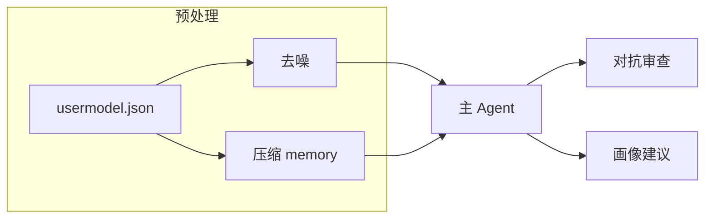

# ai_job 代码说明

本文档概括仓库内 **Python 源码与配置的职责划分**、**运行时数据流**，以及 **常用入口**，便于维护与二次开发。

---

## 1. 仓库用途概览

本项目演示如何用 **LangChain 工具调用型 Agent** 结合 **用户画像 JSON** 与 **可选的多阶段「管道」角色**（去噪、上下文压缩、红队对抗审查、画像补充建议）。  

模型端点、密钥与档位定义在 `modelCfg.json`；终端用户信息与会话状态定义在 `usermodel.json`；管道专用人设与可选 JSON Schema 输出定义在 `role_profiles.json` 与 `schemas/`。

---

## 2. 目录与文件索引

| 路径 | 说明 |
|------|------|
| `main.py` | 最小 CLI 入口：调用 `run_user_query` 并打印结果。 |
| `demo.py` | 分步演示（加载配置 → 构造 Agent → 完整管道）；**始终调用真实 Chat API**（默认用户童倩 USR003）。 |
| `demo_mocks.py` | 可选：单元测试或自建脚本里 patch 管道 / Agent 时的假实现；**当前 `demo.py` 不再使用**。 |
| `user_session.py` | **编排层**：选用户、组装 `invoke` 参数、串联管道四步与主 Agent、合并返回字典。 |
| `user_model.py` | **数据层**：加载/校验 `usermodel.json`、`role_profiles.json`，拼装主 Agent 用 `system` 长文本。 |
| `role_pipeline.py` | **管道业务层**：去噪、压缩记忆、对抗审查、画像建议的入参拼装与调用顺序（调用下层 LLM 执行器）。 |
| `pipeline_llm.py` | **管道 LLM 执行层**：按 `PipelineRoleProfile` 选模型、单轮 Chat、可选 `with_structured_output(JSON Schema)`。 |
| `model_cfg.py` | 读取 `modelCfg.json` 为带类型的 `ModelEntry` 列表。 |
| `lc_agent/` | LangChain Agent 工厂：`ChatOpenAI`、提示模板、内置工具、`create_agent_executor`。 |
| `lc_agent/structured_output.py` | 从项目根加载 JSON Schema 并绑定到 `ChatOpenAI`。 |
| `schemas/*.json` | 各管道角色结构化输出的 JSON Schema（与 `role_profiles.json` 中路径对应）。 |
| `modelCfg.json` | 模型档位列表（OpenAI 兼容 API）。 |
| `usermodel.json` | **用户数组**：每条含画像、目标、`context_memory`、`current_question`、`model_level` 等。 |
| `role_profiles.json` | 四条固定键：`question_denoiser`、`context_compressor`、`adversary`、`profile_enricher`。 |

---

## 3. 模块依赖关系（自上而下）

```
main.py / demo.py
    └── user_session.run_user_query
            ├── user_model（加载用户、角色、system prompt 文本）
            ├── lc_agent.create_agent_executor（主对话 Agent）
            └── role_pipeline（若 use_role_pipeline=True）
                    └── pipeline_llm.run_pipeline_llm（单次管道 Chat）
                            ├── model_cfg.load_model_list
                            ├── lc_agent.chat_model_from_entry / select_model_by_level
                            └── lc_agent.structured_output（可选 Schema）
```

**解耦要点**：

- `user_model` **不依赖** LangChain，只负责 JSON 与字符串拼装。
- `pipeline_llm` **不负责**「问题去噪 vs 摘要」等业务语义，只执行「一条 profile + 一段 payload」。
- `demo_mocks` **不参与**生产路径；可用于自建测试脚本中对管道 LLM 打补丁。

---

## 4. 端到端数据流（启用管道时）

以下顺序在 `user_session.run_user_query` 中固定：

1. **加载用户**：`load_user_model` → `UserModel`。
2. **创建主 Agent**：`create_agent_executor(..., with_chat_history=True)`，`system_prompt = build_system_prompt_from_user(user)`。
3. **问题去噪**：`denoise_question(current_question, question_denoiser)` → 字符串 `denoised`。
4. **上下文压缩**：`compress_context_to_messages(context_memory, context_compressor)` → `chat_history` 消息列表 + 可选摘要文本 `summary_text`。
5. **主 Agent**：`executor.invoke({"input": denoised, "chat_history": ...})` → `output`。
6. **对抗审查**：`adversarial_review(output, denoised, adversary)`。
7. **画像补充**：`suggest_profile_enrichment(..., profile_enricher)`，可附带 `summary_text` 与对抗文本。

返回字典在原生 `AgentExecutor` 结果基础上增加：

- `pipeline`：原始问题、去噪结果、压缩摘要、是否使用了压缩历史等元信息；
- `adversarial_review`、`profile_enrichment`：字符串（启用 Schema 时可能是格式化的 JSON 文本）。



---

## 5. 管道角色的模型与结构化输出

- 每条 `PipelineRoleProfile` 含 `model_level`，通过 `select_model_by_level` 在 `modelCfg.json` 中选一条 `ModelEntry`。
- 若配置 `output_schema_path`，`pipeline_llm` 会调用 `ChatOpenAI.with_structured_output(schema, method="json_schema")`；失败时告警并回退普通文本生成。
- 可选 `structured_primary_field`：在去噪、压缩等场景从 JSON 对象中提取**主字符串字段**（如 `clean_question`、`summary`）供下游使用。

---

## 6. 运行方式

| 命令 | 说明 |
|------|------|
| `python main.py` | 使用默认首用户，真实调用（需 API 可用）。 |
| `python demo.py` | 分步打印；全流程真实 LLM；未指定用户时默认 `usercode=USR003`。 |
| `python demo.py --username tongqian --usercode USR003` | 显式指定登录名与业务编号（匹配规则同 `load_user_model`）。 |
| `python demo.py --verbose-agent` | 打开 AgentExecutor 详细日志。 |

---

## 7. 测试与 Mock 约定

- 若需在无 API 环境下跑通管道，可在自己的测试代码中对 `role_pipeline._run_pipeline_llm`（即 `pipeline_llm.run_pipeline_llm` 在 `role_pipeline` 内的别名）或 `AgentExecutor.invoke` 打补丁；可参考 `demo_mocks.py`。
- 请勿在生产业务代码中 `import demo_mocks`。

---

## 8. 版本与依赖提示

- 使用 `langchain`、`langchain-openai` 等与 OpenAI 兼容 Chat API；工具调用依赖 `bind_tools`。
- 若兼容服务端不支持 `json_schema` 结构化模式，`pipeline_llm` 会捕获异常并回退为普通生成。

---

*文档与最近一次代码整理同步：模块拆分 `pipeline_llm`、`demo.py` 仅真实 API、编排注释集中在 `user_session` 与 `role_pipeline`。*
